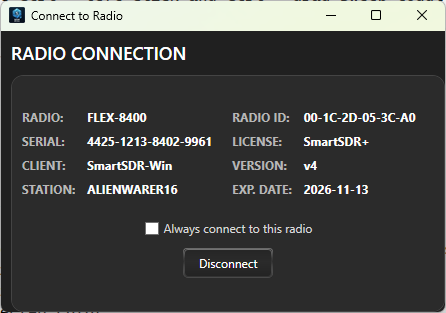
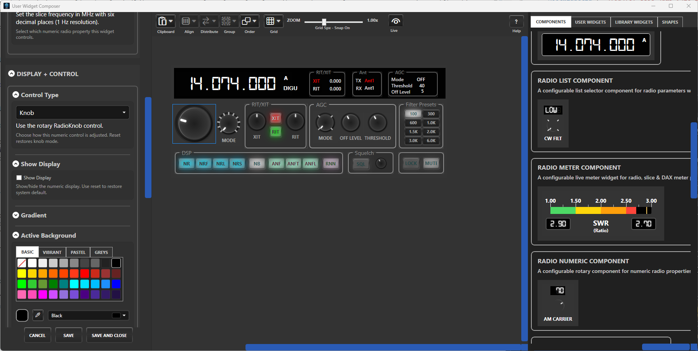
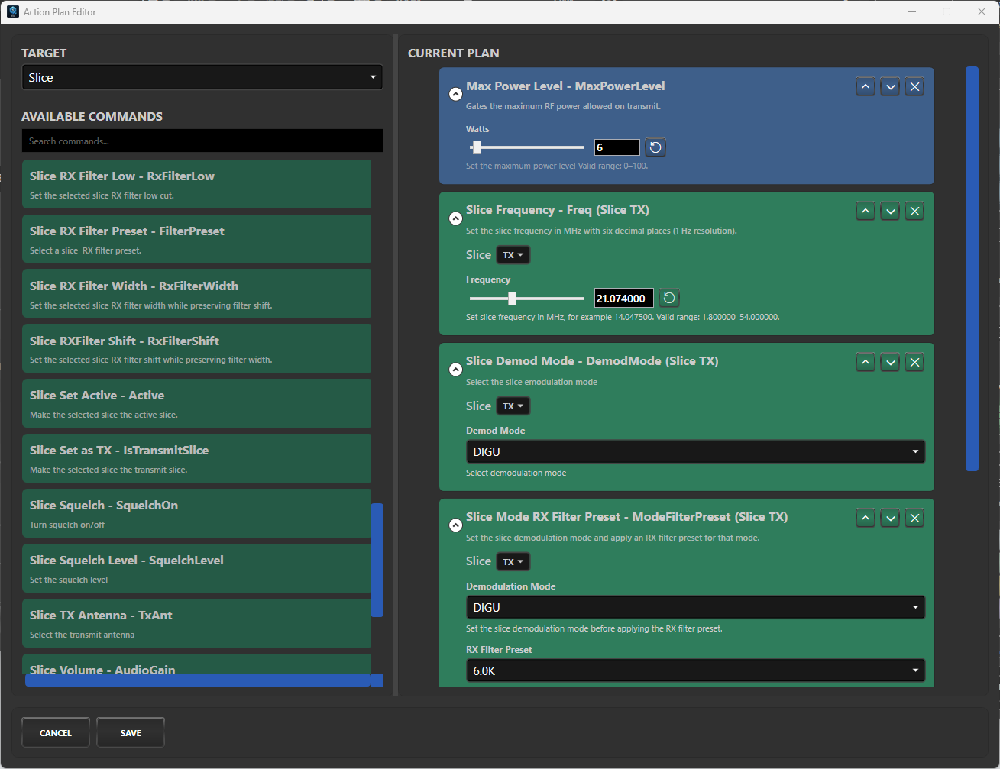
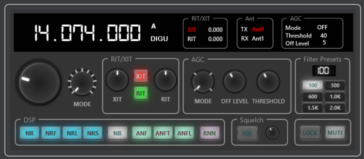
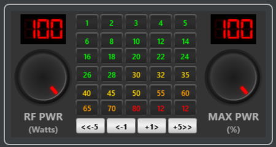
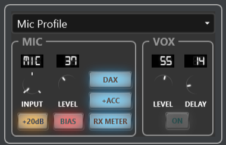
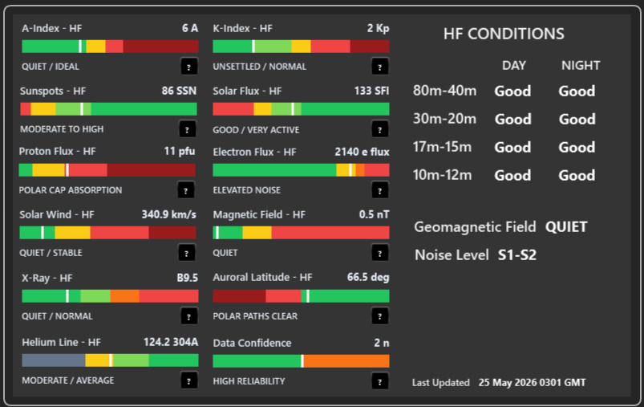
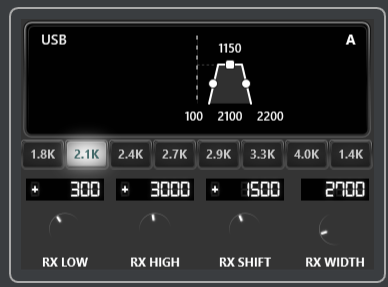
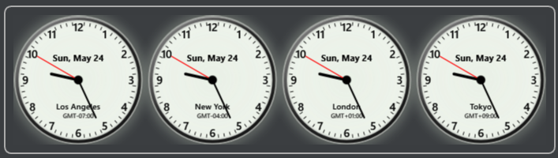

# SDRStudio

SDRStudio lets you build your own custom control surfaces for FlexRadio operation, so the tools you need are always one click away. Instead of working only inside a fixed application layout, you can create task-specific widgets for the way you actually operate: contesting, ragchewing, digital modes, DX chasing, station monitoring, or any other workflow you want to streamline.

With SDRStudio's Widget Composer provides a rich set of omponents that are the building blocks for creating custom widgets. Each widget can be assembled from one or more components, letting you combine simple radio-aware controls into a custom operating panel that matches a specific task, station setup, or workflow. The following are the list of available components: 

- **Action Command** - Runs a configured sequence of radio or slice actions from a single button. Use it for one-click operating tasks, quick station changes, or custom command macros.

- **Command Line** - Sends raw commands to the radio and displays the response. This is useful for advanced users who want direct command access inside a widget.

- **Radio Boolean** - Displays or toggles on/off radio properties such as VOX, DAX TX, or Mic Bias. It can be styled as a normal button or a lit indicator-style control.

- **Radio Equalizer** - Provides TX or RX equalizer controls for audio shaping. Use it to build quick access panels for transmit audio, receive audio, or operating-specific EQ settings.

- **Radio Frequency** - Displays and tunes a slice frequency. It gives you a focused frequency control that can be placed exactly where you want it in a custom widget.

- **Radio List** - Selects from radio properties that have a fixed set of choices. This is useful for modes, options, and other settings where the radio exposes a defined list of values.

- **Radio Meter** - Displays live radio, slice, or DAX meter values. Meters can be used to monitor levels, signal behavior, power, SWR, and other changing values at a glance.

- **Radio Numeric** - Adjusts numeric radio properties using a knob or slider. Use it for settings such as gain, levels, filter values, or other precise numeric controls.

- **Radio Preset** - Creates preset buttons for radio numeric and list properties. This is useful when you want fast access to known-good values without manually adjusting a control each time.

- **Radio Profile** - Selects Mic, TX, or Global radio profiles. It makes profile changes available directly from your custom operating surface.

- **Radio RX Filter** - Controls slice RX filter low, high, width, and shift settings. This is useful for building dedicated receive-filter controls for different modes or operating styles.

- **Radio Text** - Displays, and for non-readonly values allows the editing of, radio, slice, and network values as text readouts. Use it for clear status displays such as frequency, nickname, IP information, slice state, or other radio data.

- **Slice Selector** - Chooses the slice used by slice-dependent components in a widget. This lets a widget target a specific slice instead of relying only on the main application's master slice selection.

- **Space Weather** - Displays current solar and propagation information from HAMQSL. Use it to keep an eye on solar flux, sunspots, A/K index, X-ray class, aurora, HF band conditions, and related propagation indicators.

- **World Clock** - Shows a configurable analog or digital clock for a selected city and time zone. It is useful for DX work, contesting, and keeping track of operators or regions around the world.

SDRStudio also makes it easy to share your work with other operators. Custom widgets can be exported as widget bundles and imported into another SDRStudio installation, so users can trade useful layouts, station tools, and operating workflows with the wider FlexRadio community. Build a widget once, refine it for your station, then share it so others can adapt it for their own operating style.

## Videos

- [A Brief Introduction](https://youtu.be/ei4kXl-OwkI)
- [Widget Editor Overview](https://youtu.be/rPUchksGyWU)
- [Widget Editor Deeper Dive](https://youtu.be/zTmdJlmJJI8)
- [Action Button Component](https://youtu.be/Pfo_ce5HcZw)

## Screenshots

### Application
The following are screenshots of various application windows

<figure>
  
  <figcaption>Connection window</figcaption>
</figure>

<hr>

<figure>
  
  <figcaption>Widget editor</figcaption>
</figure>

<hr>

<figure>
  
  <figcaption>Action button plan editor</figcaption>
</figure>

### Library Widgets

The following are screenshots of some of the library widgets that are included with SDRStudio. They were all created using SDRStudio. Feel free to use and modify them. 

<figure>
  
  <figcaption>Slice control widget</figcaption>
</figure>

<hr>

<figure>
  
  <figcaption>Power presets widget</figcaption>
</figure>

<hr>

<figure>
  
  <figcaption>Audio input widget</figcaption>
</figure>

<hr>

<figure>
  
  <figcaption>HF space weather widget</figcaption>
</figure>

<hr>


<figure>
  
  <figcaption>RX filter widget</figcaption>
</figure>

<hr>


<figure>
  
  <figcaption>World clock widget</figcaption>
</figure>

## Download

Download the latest SDRStudio installer from the [Releases page](releases/latest):

```text
SdrStudioSetup-<version>.exe
```

Run the installer and follow the setup prompts.

## Requirements

- Windows 10 or later.
- FlexRadio with SmartSDR for radio operation.
- Internet access during setup if the .NET Desktop Runtime is not already installed.

The installer checks for the required Microsoft .NET 9 Desktop Runtime x86 and downloads it from Microsoft if needed.

## What SDRStudio Does

- Connects to FlexRadio/SmartSDR sessions.
- Builds custom widgets with the Widget Composer.
- Provides radio-aware controls such as meters, buttons, text readouts, numeric controls, selectors, and profile controls.
- Assigns launchable widgets to main-window launcher buttons.
- Imports and exports user widget bundles.
- Includes generated in-app HTML help and a component reference.

## First Run

1. Start SDRStudio from the Start Menu or desktop shortcut.
2. Connect to your FlexRadio from the Radio Connection window.
3. Open the Widget Library.
4. Create or edit widgets in the Widget Composer.
5. Assign widgets to launcher buttons for quick access.

## User Data

SDRStudio stores user preferences and custom widgets under:

```text
%LOCALAPPDATA%\SdrStudio
```

This folder may contain your preferences, launcher layout, window layout, and user-created widgets. Back it up before uninstalling or testing fresh installs if you want to preserve your setup.

## Uninstall

Use Windows Settings:

```text
Settings > Apps > Installed apps > SDRStudio > Uninstall
```

Uninstalling the application removes installed program files. User data under `%LOCALAPPDATA%\SdrStudio` may remain so future installs can keep your settings and widgets.

## Documentation

SDRStudio includes built-in help covering:

- Getting started
- Main window
- Launcher panel
- Widget library
- Widget composer
- Radio connection
- Component reference

Open help from inside the application.

## Author

Created by Ross Dargahi, W9TVX, with assistance from ChatGPT Codex.

Copyright (c) 2026 Ross Dargahi. All rights reserved.


